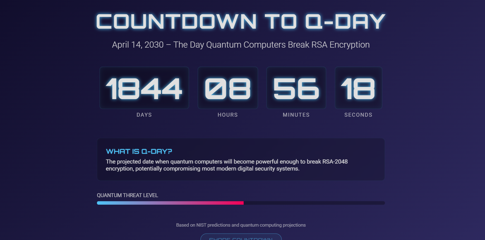
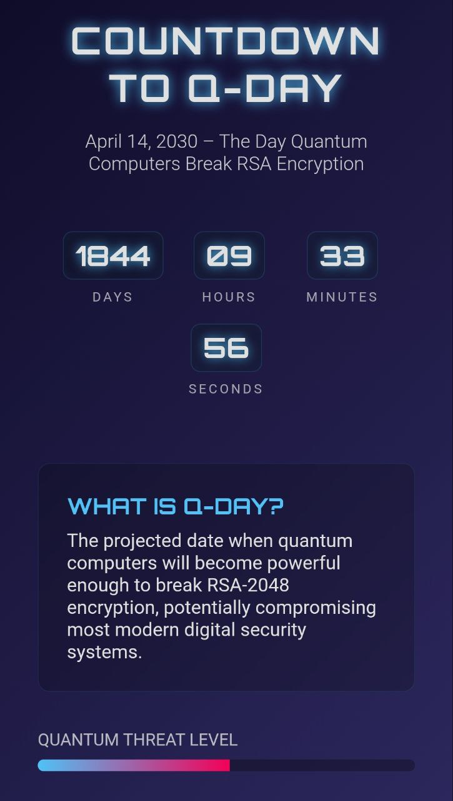

# 🚀 Q-Day Countdown

[](https://q-day-countdown.vercel.app/)
[](https://vercel.com/new/git/external?repository-url=https://github.com/Hope-Alemayehu/q-day-countdown)

A responsive countdown to April 14, 2030 - when quantum computers may break RSA encryption.

## 🌟 Live Deployment
➡️ **[https://q-day-countdown.vercel.app](https://q-day-countdown.vercel.app)**

## 📸 Screenshots

| Desktop | Mobile |
|---------|--------|
|  |  |

## ✨ Features

✔️ **Live Countdown**: Days, hours, minutes, seconds  
✔️ **Threat Level Meter**: Visual progress indicator  
✔️ **Fully Responsive**: Mobile-optimized design  
✔️ **Dark Theme**: Easy on the eyes  
✔️ **Shareable**: One-click social sharing  

## 🛠 Tech Stack


## 🚀 Quick Deploy

```bash
# Clone repository
git clone https://github.com/Hope-Alemayehu/q-day-countdown.git
cd q-day-countdown
```

```
# Deploy to Vercel
npm install -g vercel
vercel
```

## 📂 Project Structure 
q-day-countdown/
│── index.html
│── style.css
│── script.js
├── screenshots/
│   ├── desktop.png
│   └── mobile.png
└── README.md

## 🎨 Customization Guide

### Change Target Date:

```javascript
// script.js
const qDay = new Date(Date.UTC(2030, 3, 14)); // Year, Month-1, Day
``` 

### Update Colors:
```css
/* style.css */
:root {
  --primary-color: #0f0c29;
  --secondary-color: #302b63;
  --accent-color: #4fc3f7; /* Neon blue */
}
```
## 🤝 How to Contribute
1. Fork the repository
2. Create a new branch (git checkout -b improve-feature)
3. Commit changes (git commit -am 'Add amazing feature')
4. Push to branch (git push origin improve-feature)
5. Create a Pull Request

📜 License
MIT © Hope-Alemayehu
